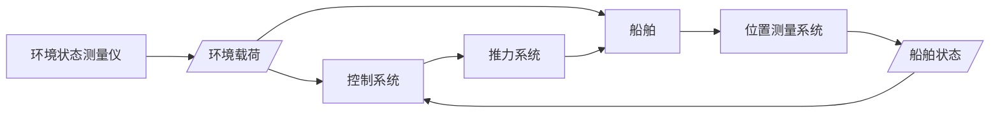
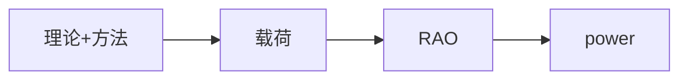

# 浮式结构定位系统
- 集中质量法：有限差分法
- 系泊链破坏的主要形式：脆性断裂
- 
- 提升角0度抓力最大
- 涌浪定义
- 系泊线材料：链条、钢缆、合成纤维
- 承受水平力和垂向力的锚：
- 疲劳状态

为什么需要系泊系统

系泊系统的分类

单点系泊

什么是横向 （沿着船宽）

什么是6个自由度：横摇、纵摇、艏摇、横荡、纵荡、垂荡

## 综述

从传统的重力式采油平台，到导管架式平台

2种定位方式：
- 系泊定位（被动式）海底设置某种位置固定的基底设备
  
  - 船用系泊定位：临时停泊，无风暴的浅水区，单锚单线系泊为主，布置在船首，，单一成分的链条，抛锚起锚由本身设备进行
  
  - 离岸系泊定位：延长浮式结构的寿命，作业条件和生存条件，单点系泊、多点系泊，至少4根，系泊材料种类多，抛锚起锚靠辅助船

按定位时间进行分类：

1. 移动性系泊系统：铺管、埋管
2. 暂时性系泊系统：钻井平台
3. 永久性系泊系统：油田大小

- 动力定位（主动式）：海底某定点与水面浮式结构之间建立某种通信联系

### 常见的系泊类型

#### 多点系泊

首和尾各有一根以上的系泊线将结构直接系泊于海底。

既限制直线运动，又限制旋转运动。

从成果效益出发，只适用于外载荷的方向性十分确定的情况

例子：半潜平台、SPAR

4点在浮式结构上，8根线

张力腿平台也是多点系泊，用张力腱

FPSO，船型结构的多点系泊系统，外载荷方向性十分确定，设计海况较低。缺点：横向受力较大

#### 单点系泊

大部分FPSO

允许绕单点自由运动，有效减少作用力，旋转功能使FPSO的系泊力趋于最小。缺点是技术成本高，技术复杂

FPSO的单点系泊系统3个功能：

- 定位系泊功能
- 液体输送及电力、光控传输功能
- 特定的条件实施现场解脱

##### 转塔式系泊系统

内转塔式常用于中等水深及深水海域的平台，系泊装置一般设在FPSO的船首

包括转塔及其套筒（2部分通过轴承连接）、锚、液体传输系统和龙门结构

- 优点是转塔直径可以设计得很大

- 缺点是堆船体结构造成影响，减小舱容；当转塔的位置接近FPSO的中心时，风标效应消失。按照风标效应的强弱分为：
  - 顺应式内转塔，360度
  - 主动式内转塔，270度

外转塔式类似，转塔位于船体外部：
- 减少船体必需的维修
- 工作台位于水平面以上，浅水，内：水下

根据转塔外伸位置不同，分为：
- 水上转塔系泊：外伸结构
- 水中转塔系泊：双轴承结构

##### 塔式系泊系统

刚性塔结构固定于海底，作为永久性系泊油轮的锚点。主要特点是：油轮与塔之间通过一个永久性的软钢臂结构（叉形结构）或系船索布置连接。

包括：塔、系泊部分、生产传输系统

- 优点：可以布置较多的立管
- 缺点：只适用于浅水区域

渤海友谊号、渤海明珠号

##### 悬链式浮筒系泊系统

穿梭油轮或FSOs

浮筒，成本较低

##### 单锚腿式系泊系统

穿梭油轮或FSOs

浮筒只由**一根**锚链线系泊于海底基础，浮筒与油轮间通过钢性臂连接

分为带立管和不带立管

不带立管的系泊系统安装水深不大

#### 动力定位系统

走向深海，更需要

借助于推进器保持浮式结构位置，测定位移和方位变化，通过自动控制系统堆位置反馈信息进行处理与计算，控制使浮式结构恢复到初始/指定位置和最有利的方向

主要组成部分包括：
- 动力操纵系统
- 推进器系统
  - 方位角推进器：螺旋形√
  - 喷射式推进器：浅水
  - 摆线式推进器：适于需要高操纵性和快速反应的船只
  - 固定式推进器：√
- 位置测量系统：船只的具体位置提供给控制系统
- 动态定位控制系统：控制在具体的位置和方向，通过测量风速，浮式结构的横摇、纵摇幅度并进行处理，将受力信息传给推进系统

优点：
- 适于恶劣海况的区域，浅水和深水
- 方便快速

缺点：
- 较高建造成本、维护成本、运行成本
- 较高风险（高频）
- 极其恶劣的环境或浅水大潮时可能失位
- 不适于改装的FPSO

## 定位方式与系泊材料

### 悬链线式系泊方式

系锚点只受水平方向的力，系泊线的回复力由其自身的重力产生，与海底部分有较大的接触面积，常用于相对较浅的海域

底部链条+钢缆+顶部链条，减少受到的摩擦损害

最小位置、平衡位置、最大位置

### 张紧式系泊方式

深水或超深水中，随着作业水深增加，链条的自重也会快速增加

张紧式系泊线总是处于张紧状态，回复力由自身的弹性产生，海底锚同时承受水平和铅直方向的力，且在海底占据范围小很多

#### 链条

- 有横档链条
- 无横档链条

有横档链条易操作，不易发生扭结，增加抗弯曲能力，但是容易发生松动，多用于暂时性或移动性

无横档链条永久性系泊系统

由半径和材料共同决定。链条直径$D$，构成链环的钢条直径，称作名义直径。

ORQ

- 塑性断裂
- 脆性断裂（最主要）
- 疲劳断裂
- 应力腐蚀

#### 钢缆

六股式，螺旋股式，多股式

钢丝绳股数、每股钢丝绳钢丝数

#### 合成纤维材料

深水应用：质量轻、强度与质量比大

- 优点：较大的水平回复力
- 缆绳的轴向刚度随轴向张力及力的作用时间而变化，容易偏移

#### 重块

控制系泊系统的响应，降低成本。通常在靠近海底部分的系泊线上连接重块

#### 浮筒

浮筒提升地面部分的系泊线，减小系泊线的质量，增加系泊线的水平刚度，减小垂向载荷

缺点：增加连接和安装的复杂性

球型或圆柱型

#### 其他连接部件

卸扣、转环等

检查和更换这些部件难度很大，采取合理的防腐蚀措施

#### 绞盘

收放系泊线、调节系泊线张力、测试锚载荷等

- WINDLASS
- CHAIN JACK
- DRUM-TYPE WINCH
- LINEAR WINCH

#### 导缆器和止链器

疏导和控制系泊线，放置系泊线的滚动

## 系泊系统静力分析

### 不考虑弹性的系泊线悬链线方程

悬链线：具有均质、完全柔性而无延伸的链条或钢缆

取小段ab，有$T_a,\theta_a,T_b,\theta_b$

$w$缆索的单位长度重量，d$l$单元长度

$$(T+\mathrm{d}T)\cos(\theta+\mathrm{d}\theta)-\cos\theta = 0$$

$$(T+\mathrm{d}T)\sin(\theta+\mathrm{d}\theta)-T\sin\theta-w\mathrm{d}l = 0$$

化简得：

$$T\mathrm{d}\theta = w\cos\theta\mathrm{d}l$$

$$\mathrm{d}T = w\sin\theta\mathrm{d}l$$

近似认为：

$$\mathrm{d}x = \mathrm{d}l\cos\theta$$

$$\mathrm{d}y = \mathrm{d}l\sin\theta$$

$$1. \qquad T_0 = T_a\cos\theta_a = T_b\cos\theta_b$$

$$\mathrm{d}T = w\mathrm{d}y$$

$$2. \qquad T_b = T_a+wy$$

$$\mathrm{d}y = (T_0/w)(\sin\theta/\cos^2\theta)\mathrm{d}\theta$$

$$\mathrm{d}x = (T_0/w)(1/\cos\theta)\mathrm{d}\theta$$

$$\mathrm{d}l = (T_0/w)(1/\cos^2\theta)\mathrm{d}\theta$$

### 单一成分系泊线静力分析

$$T = T_0+wh$$

$$h = (T_0/w)(\sqrt{\tan^2\theta+1}-1)$$

$$S = (T_0/w)\sinh^{-1}(wl/T_0)$$

$$\tan\theta = wl/T_0$$

$$\theta, w,l,T_0,T,h,S$$

$T_0$：任一悬点处受力的水平分力；$\theta$：倾角

### 多成分系泊线静力分析

二成分系泊线：连接处切线一致1-2段由原公式表示，2-3段接海底，可以代入单一系泊线的公式

9个公式，14个变量，有的通过迭代求解，有的已知预张力，确定预张状态。

多成分：中间部分可以是重块

### 考虑弹性的系泊线静力方程

## 系泊系统动力分析

动力响应比静力响应严重得多

- 波频运动响应较大
- 作业水深超过150m
- 链条比钢缆受到的拖曳力更大

### 集中质量法
 
将系泊线用若干个多自由度的弹簧-质量系统代替，用有限差分法求解

由x方向的加速度引起的法向附加惯性力和切向附加惯性力和z方向的加速度

建立运动方程

### 细长杆理论

连续的弹性介质，采用有限元法求解

### 系泊阻尼

意义：准确预报浮式结构的运动响应和系泊线受力

**浮式结构系统阻尼**包括：
- 兴波阻尼
- 波浪漂移阻尼
- 结构粘性阻尼
- 系泊系统阻尼

系泊阻尼最大可达整个系统阻尼的80%左右

- **内阻尼**：由系泊线材料特性决定
- **流体动力阻尼**和**海床摩擦阻尼**受上部浮式结构运动影响

通常，将阻尼等效为线性化的阻尼系数

- **模型试验方法**
  - 自由衰减试验方法：不连接系泊系统和连接系泊系统的试验结果进行差值计算
  - 指示图法：在一个激励周期内耗散的能量，施加正弦激励得到系泊线顶端张力和顶端位移在一个激励周期内的封闭曲线面积

$$E = \int_0^TF_H\frac{\mathrm{d}X}{\mathrm{d}t}\mathrm{d}t$$

$$F_H = B\frac{\mathrm{d}X}{\mathrm{d}t}$$

## 锚的设计与选型

利用锚的抗拔承载力，使浮式结构保持稳定位置

- 一定承载力
- 有效嵌入海床
- 锚的形状、材料和大小便于存储和运输

分类

- 重力锚：依靠自身重力，承受水平和垂向的能力都很强
- 拖曳嵌入式锚：锚前部与土壤的摩擦，承受较大的水平力，承受垂向力不强
  - 有杆锚（横杆），阻止锚爪倾翻，起稳定作用
  - 无杆锚，2个爪同时入土
  - 大抓力锚，有杆转爪锚，很大抓重比
  - 特种锚，永久性系泊锚...

按抓重比：锚抓力/重力

- 桩锚：中空钢管通过打桩安于海底，靠管侧与土壤的摩擦力来抵抗外力，能承受水平力和垂向力
  - 打入桩
  - 钻孔灌注桩
  - 扩底桩

- 吸力锚，类似于桩锚，但中空的钢管直径要大得多，下方敞开。进入泥面，向外排水，使管内外出现压力差，当管内压力小于管外，钢管即被吸入海底。
  
- 法向承力锚：类似于拖曳式锚，但深入土壤更深，可以承受水平力和垂向力，适合深水，用链条代替，走向深远海

初倾角、锚柄长度、锚受力

经验公式：
1. $$E = F/W$$

$W$：空气中的重力

$F$：锚抓力，极限载荷

2. $$F = KW^\alpha$$

吸力锚的工作原理：吸水-注水，吸空气-注空气

吸力锚与系泊线的连接存在一个“最优深度”，通常连接点稍低于该点。点的位置主要取决于基础的长径比

最优深度上只产生平动

在上拔力作用下，内部土体产生超静孔压

法向承力锚：
- 传统的刚性锚胫被软索锚胫代替
- 锚胫与锚板之间的角度可以变化

安装拖曳缆为主要缆vs系泊线为主要缆

浅埋失效：锚板埋置深度<=3倍的锚板长度，表现为当锚板失效，锚板表面某一范围内的土体被一同带出

深埋失效：土体沿着锚板上表面向下流动，土体的塑性失效

锚的承载力：
- 锚的面积
- 锚的嵌入深度
  - 锚板的形状
  - 锚胫的形状

## 锚的安装

拖曳式锚的安装：依靠安装船、锚钩和浮标绳来辅助完成

吸力锚的安装：安装船进行辅助，还需要ROV配合抽气

法向承力锚
- 单缆安装法（只适用于带安全销），带尾缆控制定位。整体接触海床后拖曳入土，达到设定荷载后，安全销自行断裂。通过系缆和尾缆相连回收
- 双缆安装法：2艘安装船，一艘控制安装缆，一艘控制系泊缆

## 系泊系统设计过程

资料：
- 环境
- 平台
  - 尺寸重量
  - 安装
- 平台运行要求
  - 位移限制
  - 功用
  - 使用寿命
  - 定位能力

计算分析与比较
- 系泊系统
  - 张紧式
  - 悬链式
  - 动力定位
- 组成部分
  - 锚链
  - 锚的形式

系泊线静位移、动位移、总张力

常用设计规范：API RP 2SK、DNV（挪威船级社）

环境标准：百年一遇的风、浪、流（缺少资料可以加上十年一遇的资料）

系泊设计极限状态

- 最大极限状态
- 偶然极限状态：一根破坏的情况下仍有足够强度
- 疲劳极限状态：周期性载荷

### 载荷分析

#### 波浪

风成浪和涌浪（风停下后余下的波或风区以外的波）

规则波

不规则波：若干个规则波叠加

有效波幅：$\zeta_{1/3} = 2\sigma$

有效波高：$H_{1/3} = 4\sigma$

各态历经的平稳过程下服从正态分布

服从正态分布的窄带谱，服从瑞利分布

波浪的最大波高：发生概率为1/1000的波高

$\exp(-2(\frac{H_{max}}{H_{1/3}})^2) = 1/1000$

$$S_\zeta(\omega_n)\mathrm{d}\omega = \frac{1}{2}\zeta_{a_n}^2$$

$$m_{n\zeta} = \int_0^{+\infty}\omega^n S(\omega) \mathrm{d} \omega$$

常见的波浪谱：

- JONSWAP:
$$S(\omega)$$

- P-M谱（海平面19.5m处的风速）

- ITTC单参数谱

#### 风

$$\frac{V_z}{V_{10}} = (\frac{z}{10})^a, a=0.09 or 0.1$$

API风谱

NPD风谱

#### 流

- 表层流，方向、速度一致
- 梯度流：方向一致，速度因海底摩擦逐渐减小
- 因波浪破碎引起的水流具有回流现象

#### 静态载荷计算

静态波浪载荷

$$F_{drift} = 2\int S(\omega)D(\omega, \omega)\mathrm{d}\omega$$

$D(\omega, \omega)$：平均波浪漂移力系数

- 规则波：$F = \frac{1}{2}\rho g B\zeta^2$
- 非规则波：$F = \frac{1}{2}\rho g B(\frac{1}{8}H_s)^2$

静态风载荷

纵向力、横向力、绕垂向轴的首摇力矩

模块法：对各种构件

$$F_w = C_w\sum(C_aC_hA)V_w^2$$

静态流载荷

低频力计算

低频风力

随时间变化的部分，通过经验风谱获得

低频波浪力

波频力计算

系泊系统总体运动分析：综合以上所有静态力，慢漂力，波频力：

$$(M+M_a)\frac{\mathrm{d}^2 x}{\mathrm
{d} t^2}+$$

计算分析方法

频域分析：频域范围内以频率响应分析浮式结构在波浪作用下的动态特性。频率响应指浮式结构系统对不同频率的正弦输入响应的**稳态值**

输入：$\zeta = \zeta_0\exp(i\omega t)$

输出：$Y = Y_0\exp(i(\omega t+\delta))$

$$H(i\omega) = \frac{Y}{\zeta}$$

RAO：$|H(i\omega)|^2$

谱分析方法的优点在于将作为随机过程的海浪和浮式结构之间的不确定关系转化为非随机的谱密度之间的确定关系

$$S_y(\omega) = S_\zeta(\omega)|H(i\omega)|^2$$

动态分析采用集中质量法

频域水动力分析

水动力分析
1. 建立模型，划分网格

浮体在不规则波中的运动

波浪谱->频率特性->运动谱

波频运动响应

时域分析

波频力计算
各个规则波叠加

## 系泊系统规范

- 永久性系泊系统
  - 强度分析：完整条件/有损坏的条件下动态分析
  - 疲劳分析：完整条件下动态分析
- 可移动式系泊系统
  - 强度分析：完整条件/有损坏的条件/瞬态条件下 拟静态分析或动态分析
  - 疲劳分析：不需要

平均位移：

最大位移：由平均位移、波频运动和低频运动分别引起的位移之和

$$S_{max} = S_{mean}+S_{lfmax}+S_{wfsig}$$

$$S_{max} = S_{mean}+S_{lfsig}+S_{wfmax}$$

系泊线长度限制

极限承载力

系泊测试载荷：确定锚系统有足够的承载能力，消除与海底相接触部分的系泊线可能存在的**松弛部分**

- 拖曳式锚：测试载荷至少为系泊线所能承受最大载荷的80\%
- 桩锚、吸力锚：具体情况
- 可移动式系泊系统：作用在锚柄上的测试载荷不能小于3倍的锚自身重力

各设备之间的距离

## 浮式结构系泊系统疲劳分析

疲劳：某（些）点承受扰动应力，足够多的循环次数作用之后局部材料发生永久变形，严重时产生裂纹并扩展的损伤过程

T-N曲线：疲劳寿命-应力幅值曲线。疲劳试验+概率统计

### Miner规则

变化的应力幅值也能用T-N曲线进行疲劳强度分析。假定不同应力幅值循环引起的结构损伤**相互间没有影响**，且与其**作用先后次序无关**。

设计疲劳寿命$1/D$：大于等于平台在某一海域的服役寿命的3倍

疲劳测试试验：

- 试验测试数据有限
- 缺乏低应力时的疲劳测试数据
- 疲劳测试

疲劳寿命计算

$$NR^M = K$$

$R$：张力范围与系泊线极限强度之比

T-T拉伸应力疲劳，双对数线性模型

无横档链条比有横档链条疲劳寿命低，但是无横档链条不会发生不容易检测的疲劳问题

$$D = \sum_{i=1}^nD_i$$

每种海况下每年的应力循环次数：

$$n_i = f_iT_i$$

低频力和波频力引起的疲劳破坏的组合：
- 简单的叠加
- 系泊线低频力和波频力响应谱的组合
- 上面的基础上引入校正因子$\rho$

疲劳分析的详细过程：

1. 确定系泊线可能遇到的一系列环境工况，包括风浪流的相关参数：速度、方向、波浪谱、有义波高。10-50个，通常选择8-12个有代表性的
2. 计算每个环境工况下系泊线的受力，包括相对于平均力的波频力和低频力
3. 确定M和K
4. 计算年疲劳损伤

### 腐蚀破坏

防止腐蚀破坏的方法通常是增加其直径

- 强度分析时不需要考虑上述由于系泊线腐蚀破坏而增加的长度
- 疲劳分析应该预先得到直径和其服务年限的腐蚀率

## 动力定位系统

优点：
- 不依赖外部设备
- 任意水深
- 定位方便快速，机动性高
- 避免碰撞，破坏海底设备

缺点：
- 建造、维护、运行成本
- 较高风险
- 更多操作人员
- 设备故障会丧失定位能力
- 极其恶劣的环境可能失位

组成：

- 测量系统
  - 位置测量系统：位置和干扰力
    - 卫星导航系统：至少4颗卫星可见，若进入遮蔽区域，信号不足，则位置信息丢失，电离层干扰、水面反射也会影响准确性
  
    - 水声位置参考系统：船体安装声学发射器，海底的固定点安装应答器。短基线、长基线
    
    - 张紧索位置参考系统：船体和海底之间桩一根钢索，恒张力情况下的倾斜度，精确度比如声学系统，但不受信号干扰
  
  - 传感器系统：风浪流，运动传感器：电罗经（首向传感器）、垂荡传感器、陀螺仪
  
- 控制系统：多回路反馈控制系统
   1. 处理传感器信息
   2. 与基准值比较，得出偏差信号
   3. 计算恢复力和力矩，使偏差平均值减小到0
   4. 计算风力和力矩，提供风变化的前馈信息
   5. 将反馈的风力和力矩信息叠加到误差信号所代表的力和力矩信息上，形成总的力和力矩
   6. 按照推力飞陪逻辑，将力和力矩指令分配到各个推力器上
   7. 推力指令转化为推力器指令

- 推力系统

- 动力系统：整个定位系统供电并负责电源的分配和管理

推力分配：

- 选型和设计
- 输出的调节
- 水动力干扰
- 推力冗余

推力分配逻辑：主推进器和侧推进器

$$
T_1 = M(\frac{1}{l_1+l_2})+Y(\frac{l_2}{l_1+l_2}) \\
T_2 = -M(\frac{1}{l_1+l_2})+Y(\frac{l_1}{l_1+l_2}) \\
T_3 = X
$$

$$J = \sum_{i=1}^nt_i^2 \\

$$X-\sum_{i=1}^nt_i\cos\theta_i = 0$$

动力定位系统的可靠性和分级

- 一级系统：系统设备没有冗余度，任何单个设备的失效都可能导致船舶失去位置
- 二级系统：系统具有冗余度，单个设备的失效不会导致系统失效，包括发电机，但是线缆、管路等静态设备的失效而失灵
- 三级系统：单个设备的失效不会导致系统失效，且能抵抗任一舱室起火或浸水

动力定位能力曲线：通过在极坐标上一条0到360度的封闭包络曲线

IMCA：定位能力通过船体能抵抗的最大环境条件来衡量

API：浮体在设计海况下，满足定位要求时推力器所使用推力占最大许用推力的百分比来衡量

水平方向环境载荷与推力器产生推力的静态平衡

计算要求：
- 风浪流从同一方向作用

二阶波浪漂移力：
- 近场公式
- 中场公式
- 远场公式

螺旋桨性能计算

故障模式和影响分析（FMEA）

具体深入到各个层面的系统化的分析方法，证实单点故障不会导致非预期的后果，还能结合ROM分析，指出潜在的技术风险

- 完整模式：所有推力器正常工作
- 失效模式1：一个主推进器失效
- 失效模式2：一个艉侧推进器失效
- 失效模式3：一个艏侧推进器失效

最大推力的20\%作为推力冗余，

动力定位能力曲线：
1. 环境载荷方向
2. 总载荷
3. 各个推进器推力（推力分配原则）（是否失效需要分开考虑）
4. 使用率
5. 改变角度-->1.

时域分析：实时

## 定位系统模型试验技术

著名海洋工程水池

- MARIN-Holland
- MARINTEK-Norway
- Flow wave tank-UK
- Oceanic-Canada
- SJTU-China

造流系统：
- 池内循环：可移动的局部造流系统，调节泵的转速
- 假底循环：一端吸取池中的水
- 池外循环

系泊系统模型试验

系泊系统的水平刚度试验
目的：获得在外力的静力作用下模型的位移-受力变化曲线
- 单根锚泊线
- 整个系泊系统

模型缩尺比的选择：公认50-100，影响因素：
1. 模型大小
2. 水池的主要尺度
3. 造波机的能力
4. 水池各类仪器的测量功能

Fraud相似准则：主要作用力为重力的水流运动相似准则

- 舷侧形状与实物一致
- 足够的强度和厚度
- 模板之间粘合牢靠
- 总长误差不能超过3mm
- 试验排水量的1/3
- 上层建筑模型的制作集合相似

系泊链模型的要求按实体根据几何相似和弹性相似制作。锚链外形按几何相似模拟，悬链线形状按几何相似模拟，弹性系数相似

$$\frac{F}{\Delta l} = \frac{EA}{l}$$

配接弹簧后的长度与实物几何相似，且在弹性恢复的范围之内

分段：各段相似

立管形状几何相似：

垂直刚性立管

柔性立管：钢丝绳

转塔式FPSO系泊装置的

仪器：
- 海洋环境条件测量仪器：风速仪、浪高仪、流速仪
- 6自由度运动测量仪：机械式、加速度运动测量仪、

焊接在假底上

专用信号线接至响应的信号放大器或二次仪表，把信号采集进入计算机

静水中浮体模型的单自由度运动衰减试验

系泊线预张力的调节

每根锚泊线都要加上相同的预张力，使它们处于相同的张紧状态和具有同等的定位功能（逐一调节）

模型的风、流作用力试验

确定在不同首向角情况下，作用于模型上的风、流作用力以及力矩系数，验证模型在试验中所受到的风力和流力

规则波中试验

目的：获得模型在波浪作用下运动和受力的频率响应函数，还可以确定波浪慢漂力和力矩系数（对周期敏感，涵盖浮式结构常规的共振频率）

10个以上完整的规则波

运动和载荷的幅值响应和相位响应

不规则波试验：直接获得平台在真实海况下的水动力性能

待不规则波到达模型约1min后，开始同步记录所有的测试数据直至该单项实验结束为止

试验时间至少相当于实体在海上1小时或者3小时

- 系统误差：测量手段不够完善导致的零漂现象

- 随机误差：不可预知因素引起，包括环境的温度、湿度、空气的抖动等等

时域统计分析：
实体相应的各项数据的时历曲线，通过实验求解Weibull分布

频域谱分析

规则波实验数据分析：RAO及相关的相位相应系数

软件功能：
1. 测量信号时历

4. 实验数据的保存
5. 衰减实验数据分析
6. 规则波试验的数据分析
7. 风浪环境条件的统计分析

### 深海平台模型试验

1. 极小缩尺比
2. 自然水域
3. 截断水深模型试验

被动式混合模型试验（静态）
1. 数值模拟手段得到全

截断+数值模拟：水深截断试验

主动式模拟的混合模型试验方法：需要非常先进和精确的实时控制系统

动力定位系统允许较大的误差，试验尺度缩小反而

常用估算公式：截断因子

## WAMIT用户手册

- 6DOF
- multi 6DOF

### 
- 静水恢复力
- 附加质量和阻尼系数
- 激励力和矩（2种选项）
- 运动的幅值和相位（自由漂浮）
- 只在部分方向运动

POTEN 和 FORCE

gdf（几何形状）、pot、cfg（configuration）输入，pot p2f输出

Windows操作系统

- cmd
- cd 路径
- 运行‘c:\wamitv7\wamit’(wamit安装路径)

输入文件用txt编辑并更改后缀名

规则波输入：幅值、频率、擦还能高度间隔

随体坐标系与全局坐标系（静水面上）

时空分离

排开水的体积*密度（湿水体积）

浮心

123是位移，456是旋转

静水恢复系数的计算

无量纲化

附加质量和阻尼系数

激励力（势流理论线性化）：有浪和无浪

波高是幅值的2倍

压力积分或公式

惯性矩阵

$$
M = \left[
\begin{matrix}
  m & 0 & 0 & 0 & mz_g & -my_g \\
  0 & m & 0 & -mz_g & 0 & mx_g \\
\end{matrix}
\right]
$$

惯性矩的计算：

$$I_{ij} = \rho V r_{ij}|r_{ij}|$$

软件中r为1

动压：

$$p = -\rho \frac{\partial \varphi}{\partial t}$$

规则波使用幅值和周期无量纲化

随着周期增大，附加质量趋于常值，附加阻尼趋于0

frequency和period

0周期和无限周期对应的水动力参数的计算

RAO：水动力学到运动学

输入文件：只读二进制（指针）

- GDF
  - gdf.gdf
- POTEN和FORCE
  - pot.pot
  - frc.frc

3个文件不能动，只能更改：fname.wam config.wam break.wam

额外的RAO：受迫振动

panel低阶，patch高阶

userid.wam 保密

IRAD：1->6个自由度引起 0->特定自由度 -1->不求解